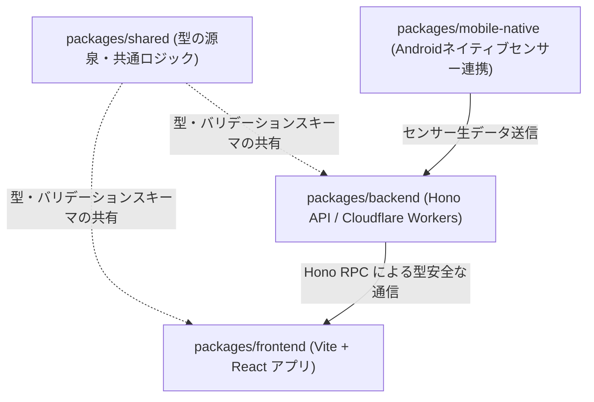
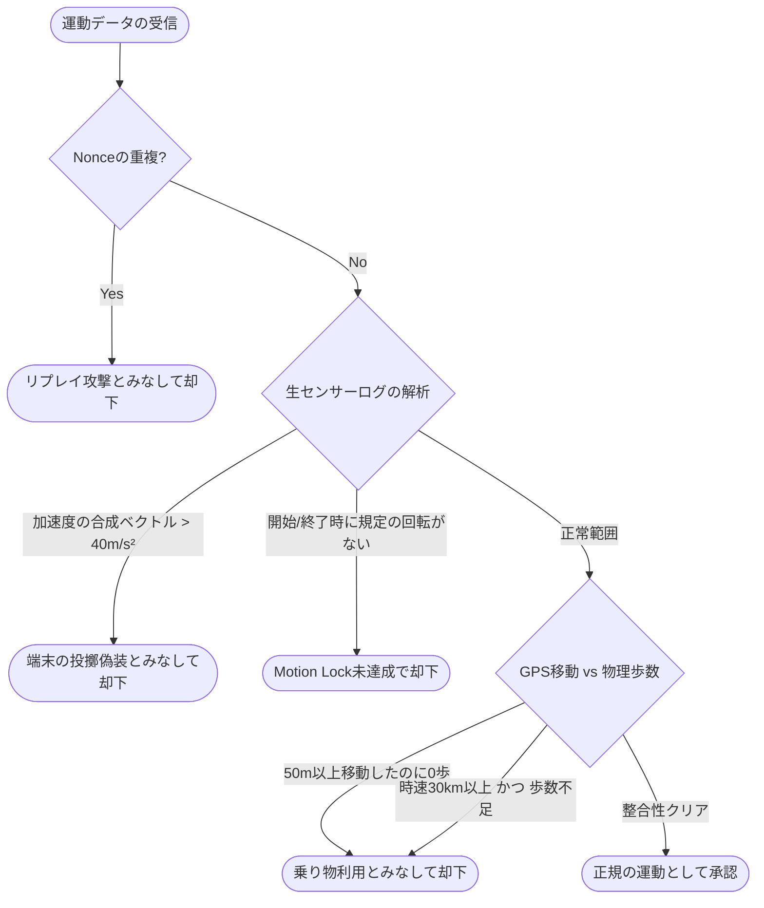

# PhysiProof ソースコード解説・アーキテクチャガイド

PhysiProof のソースコード構造、核となるアルゴリズム、および技術的な設計思想について、全体像を体系的に理解できるように解説します。

---

## 1. モノレポ構成と各パッケージの責務 (Architecture & Structure)

本プロジェクトは `npm workspaces` を使用したモノレポ構成を採用しています。
コードベースは主に以下の3つのパッケージに分割されており、各々が独立した役割を持ちながら緊密に連携しています。



### 各パッケージの責務

| パッケージ | ディレクトリ | 主な役割 |
| :--- | :--- | :--- |
| **`shared`** | `packages/shared` | **唯一の真実の情報源（SSOT）**。<br>Zodによるスキーマ定義、共通の型、チート防止の検証ロジックなど、フロント/バック両方で必要な純粋関数を定義。 |
| **`backend`** | `packages/backend` | **API サーバー・データベース管理**。<br>Cloudflare Workers / D1 環境で動作する Hono アプリケーション。API エンドポイントのルーティング、D1 へのデータ保存、Gemini API 連携、デバイス整合性検証。 |
| **`frontend`** | `packages/frontend` | **ユーザーインターフェース (UI)**。<br>Vite + React で作られた Web App。Hono RPC (`hc`) を使ったバックエンド通信、フォーム制御、地図描画（支配領域ビジュアル）。 |
| **`mobile-native`** | `packages/mobile-native` | **モバイルネイティブ機能**。<br>Android のセンサー（加速度・歩数など）や Google Maps SDK、ウィジェットの統合（Kotlin）。 |

---

## 2. Zod と Hono RPC による完全な型安全の仕組み

PhysiProof の最大の特徴は、**「Zod で定義されたバリデーションスキーマ」**がそのまま**「APIの型定義」**になり、さらに**「フロントエンドの通信クライアント」**へと連動している点です。

### データの整合性の流れ
1. **スキーマの定義 (`packages/shared/src/schemas/*`)**
   例えば、サインアップ時のスキーマは `signupSchema` (Zod) として定義され、TypeScript の型 `SignupRequest` が自動推論されます。
2. **バックエンドでの検証 (`packages/backend/src/index.ts`)**
   Hono でリクエストを受け取る際、`@hono/zod-validator` を使って `signupSchema` でボディを検証します。
   ```ts
   .post('/auth/signup', validate(signupSchema), async (c) => { ... })
   ```
3. **フロントエンドでの利用 (`packages/frontend/src/lib/hc.ts`)**
   バックエンドからエクスポートされたルーティングの型 `AppType` を使用して Hono RPC クライアント (`hc`) を初期化します。これにより、フロントエンド側で API を呼ぶ際に、リクエストボディに何が必要か、レスポンスに何が返ってくるかがエディタ上で完全に補完され、型安全に保護されます。
   ```ts
   // フロントエンドでの呼び出し例 (型エラーがコンパイル時に検知される)
   const client = hc<AppType>("/api");
   const res = await client.auth.signup.$post({ json: { loginId, password, name } });
   ```

---

## 3. チート防止 (Anti-Cheat) の検証ロジック

GPSの偽装や、端末を振るだけの疑似運動による「不当な領地獲得・カロリー稼ぎ」を防ぐため、`shared/src/logic/movement.ts` 内に独自の物理整合性検証アルゴリズムを実装しています。



1. **リプレイ攻撃対策 (Nonce)**
   リクエストごとに生成されるユニークなセッションID (`nonce`) を `used_nonces` テーブルに記録。同一データの使い回し（重複送信）を弾きます。
2. **ハードウェア真正性 (Play Integrity)**
   Android デバイスがエミュレータではなく、改ざんされていない実機から送信しているかを Play Integrity API トークンで検証します。
3. **物理運動のバリデーション**
   * **Motion Lock**: 運動の開始時・終了時に、ユーザーが特定の回転アクション（スマホをひねる動作など）をしたかジャイロスコープで確認します。
   * **投擲の排除**: 加速度の合成ベクトル（ノルム）が `40m/s²` を超えた場合、スマホを投げ飛ばして運動回数を稼ぐ行為とみなし却下します。
   * **乗り物の検出**: 「GPSで50m以上移動したのに歩数が0」「移動速度が時速30kmを超えているのに歩数が不自然に少ない」場合、車や自転車での移動と判定して拒否します。

---

## 4. Gemini API 連携とハイブリッド設計 (AI & Fallback)

Gemini 2.5 Flash を「目標予測のエンジン」「マルチモーダル食事解析」「対話型パーソナルコーチ」としてバックエンドに組み込んでいます。

### A. カロリー・目標予測と物理フォールバック
* **Gemini による推論**: 基礎データ（性別・年齢・身長など）を元に、ハリス・ベネディクト方程式を加味した目標体重までの推定日数を高精度に算出。
* **物理計算によるフォールバック (`physics.ts`)**: AI の API 制限や通信エラーが発生した際、システムが停止する（SPOF）のを防ぐため、静的な熱力学計算（脂肪1kg = 7200kcal）に切り替えて概算を返す設計になっています。

### B. マルチモーダル食事解析
* ユーザーがアップロードした食事写真（Base64画像データ）を Gemini に直接インプット。
* 画像を基に、メニュー名の推定、カロリー計算、PFCバランス（タンパク質・脂質・炭水化物）、栄養学的なアドバイスを一度に行い、JSON構造化フォーマット（Structured Output）で出力してDBに格納します。

### C. AIチャットコーチとカレンダー自動連携
* ユーザーとの対話履歴を時系列（ASC）に整形して Gemini にインプットし、モチベーションを高めるパーソナルコーチとして対話します。
* **カレンダー自動連携**: AIが対話中に「予定を入れておいたよ」と応答すると、回答の末尾に `__SCHEDULE_ADD__:{"title":"...","scheduled_at":"..."}` という非表示のマーカーを付与します。バックエンドはこのマーカーを読み取って、自動的に `training_schedules` テーブルに予定をインサートします。

---

## 5. データベース設計 (Cloudflare D1)

Cloudflare が提供する SQLite ベースの分散サーバーレスデータベース **D1** を使用しています。

### 主なテーブル構造と関連性
* **`users`**: ユーザーの基本ステータス（レベル、経験値、RPG要素のステータスポイント（STR, AGI等）、目標体重など）を管理。
* **`pushup_measurements`**: 腕立て伏せなどの運動ログ。チート検証のための `sensor_log`（JSON文字列）やAI監査結果を保存。
* **`territories`**: プレイヤーがGPSトラッキングによって獲得した領域。形状を定義する `area_polygon` (GeoJSON形式) と時間帯（Morning/Afternoon/Night）を管理します。旧DBの防衛レベル列は互換性のため残していますが、現在のゲーム処理では参照しません。
  * **領域の塗り替え・統合**: 他のプレイヤーの領域と重なった部分を `@turf/difference` で差し引き、同じユーザーまたは同じチームの領域は `@turf/union` で統合します。防衛レベルによる保護はありません。
* **`chat_messages`**: コーチとの対話履歴。
* **`user_missions`**: ランニング限定のデイリーミッション。距離を伴うオンライン走行を完了すると達成となり、100 XPを受け取れます。腕立て・食事解析は機能として残りますが、ゲーム内報酬やミッション進捗を付与しません。
* **`api_usage_logs`**: APIの利用状況やエラー率の監視用ログ。
