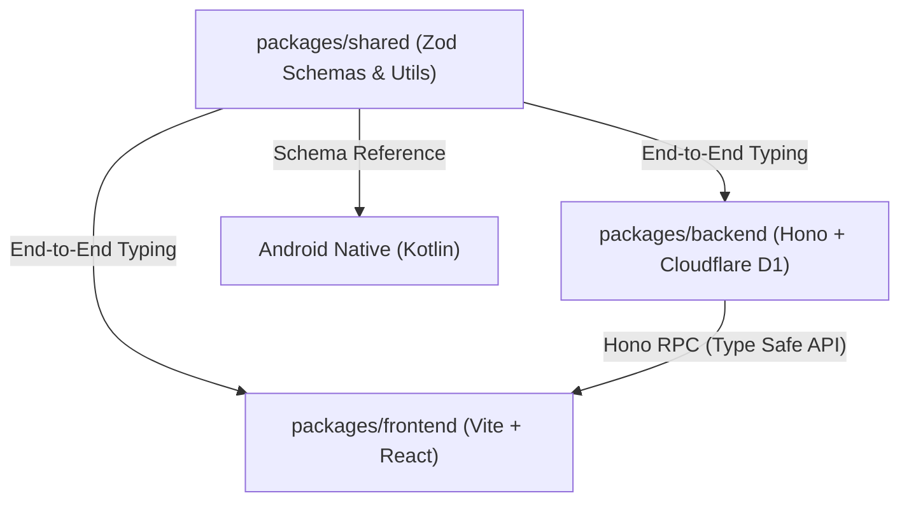
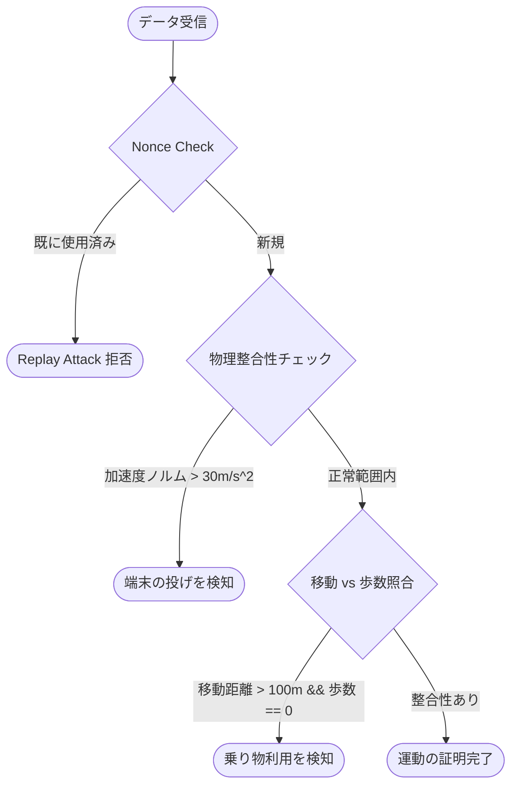

# PhysiProof: Technical Architecture & Algorithms

本ドキュメントでは、PhysiProof における技術的な独自性と、実装されているアルゴリズムの仕組みについて解説します。

## 1. アーキテクチャ概要 (Zod-Centered Monorepo)

PhysiProof は `packages/shared` を「唯一の真実（SSOT）」としたモノレポ構成を採用しています。

### Hono RPC による型安全性のメリット
- **型の再定義不要**: バックエンドの `AppType` をフロントエンドが参照するだけで、API エンドポイント、リクエストパラメータ、レスポンスがすべて自動補完されます。
- **スキーマ駆動開発**: `shared` で Zod スキーマを変更すると、即座に全パッケージでコンパイルエラーが発生するため、不整合を未然に防げます。

## 2. 運動証明（Anti-Cheat）アルゴリズム

「人間による真の運動」と「機械（車・ドローンなど）による偽装移動」を区別するために、多層的な検証ロジックを実装しています。

### 解析フロー

### アルゴリズムの核心
- **物理的整合性**: `MotionValidator` (Android Native) で取得した線形加速度を解析。自由落下や投擲（Throwing）による不自然な加速度ベクトルを数学的に検出します。
- **相関検証**: 位置情報 (GPS) による移動ベクトルと、Step Counter API (物理センサー) による歩数データを突き合わせ、機械的な移動を排除します。

## 3. Gemini API による身体遷移予測

Gemini API を単なるチャットではなく、**構造化データの推論エンジン**として活用しています。

### プロンプトエンジニアリングの工夫
- **System Instruction**: 専門的なAIアドバイザーとしての役割を与えつつ、「1日のカロリー不足量は1000kcal以内」「月間の体重減少は5%以内」といった医学的ガイドラインをプロンプトに組み込んでいます。
- **Few-Shot Prompting**: 過去の消費カロリーと摂取カロリーのパターンを入力し、身体の代謝変化を予測させています。
- **Structured Output**: `response_mime_type: 'application/json'` を利用し、Gemini が生成した文字列を直接 `PredictionSchema` (Zod) でパース可能な形式で出力させています。これにより、AI の回答をそのまま UI のグラフや予測値として表示できます。

## 4. ネイティブ UI/UX の統合
Android Native 層では、以下の技術スタックを組み合わせています：
- **Jetpack Glance**: ホーム画面ウィジェットでのリアルタイムな陣地防衛状況表示。
- **Google Maps SDK**: 走行軌跡のポリゴン化と、個人・チーム領域の表示。
- **Haptic API**: レップごとの正確な触覚フィードバックによる、スクリーンレスな体験の提供。
