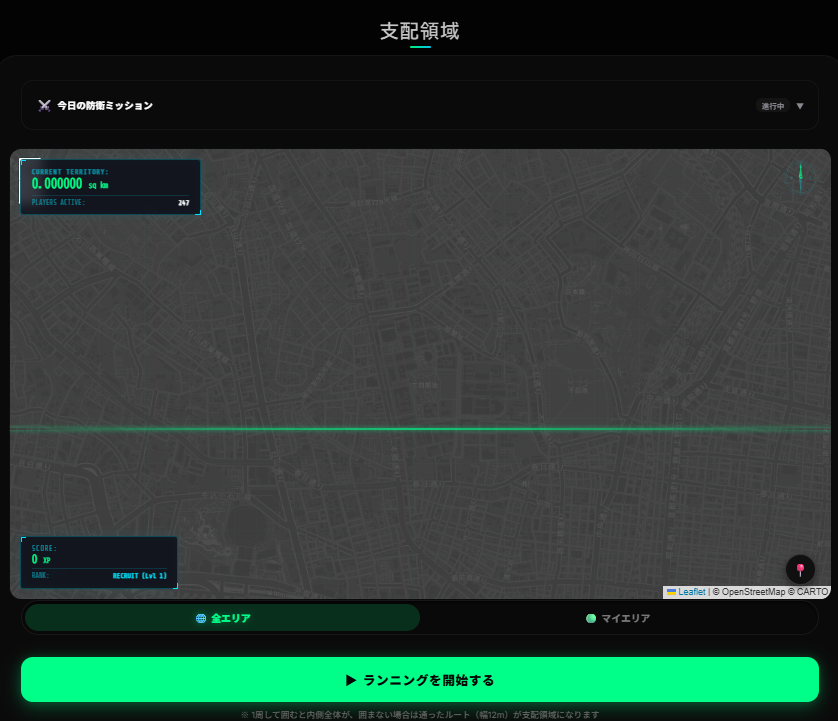
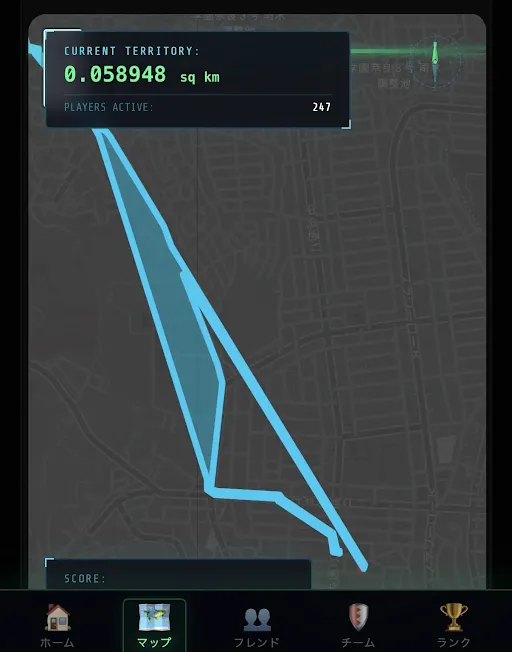

# **PhysiProof**
### リアルな街を塗りつぶせ！スプラトゥーン型都市陣取りフィットネス

<br>

**卒業制作 企画・プロトタイプ発表**
高度情報処理科 3年 24JZ0121 **紺野大輝**

---

## 発表アジェンダ

<div class="grid-3" style="margin-bottom: 18px;">
<div class="card">

### 1. 課題共有
運動不足の長期化 & 不正チート問題

</div>
<div class="card">

### 2. コンセプト
リアル都市陣取りバトル体験

</div>
<div class="card">

### 3. メニュー構成
迷わず使える主要5大メニュー

</div>
</div>

<div class="grid-3">
<div class="card">

### 4. 実機デモ
動くプロトタイプの実演実況

</div>
<div class="card">

### 5. 使用技術
Zod Monorepo & エッジアーキテクチャ

</div>
<div class="card">

### 6. ロードマップ
UI/UXデザイン強化 & 将来展望

</div>
</div>

---

## 開発背景①：運動継続の難しさ

<div class="grid-3" style="margin-bottom: 24px;">
<div class="card" style="text-align: center; padding: 30px 20px;">

<div class="stat-num stat-num-red">65%</div>

**20〜30代の運動不足率**
(スポーツ庁 全国調査調べ)

</div>

<div class="card" style="text-align: center; padding: 30px 20px;">

<div class="stat-num stat-num-red">80%</div>

**3ヶ月以内の運動離脱率**
「単調で飽きる」が最大の壁

</div>

<div class="card" style="text-align: center; padding: 30px 20px;">

<div class="stat-num stat-num-blue">78%</div>

**「数値だけは飽きる」**
(当校学生・教員アンケート)

</div>
</div>

<div class="card-highlight" style="padding: 16px;">

**課題:** 単に数値（歩数・体重）を記録するだけでは飽きる ➔ **「遊んでいたら走っていた」ゲーム性** が不可欠！

</div>

---

## 開発背景②：チートによるモチベ崩壊

<div class="grid-2" style="margin-bottom: 24px;">
<div class="card" style="padding: 26px;">

### 横行するズル（不正行為）
- **スマホ振り子機**: 揺らして歩数・距離を自動稼ぎ
- **GPS位置偽装**: アプリで瞬間移動して占領
- **乗り物移動**: 自動車や電車での不正走行

</div>

<div class="card" style="text-align: center; padding: 30px 20px;">

<div class="stat-num stat-num-red">82%</div>

**「ズルを見ると一気にやる気が削がれる」**
(独自ヒアリング調査の共感率)

</div>
</div>

<div class="card-highlight" style="padding: 16px;">

**課題:** 不正が放置されたランキングは運動コミュニティを壊す ➔ **「物理整合性による自動検証」** が必須！

</div>

---

## コンセプト：リアル都市陣取りバトル

<div class="grid-2">
<div style="display: flex; flex-direction: column; justify-content: center;">

<div class="card-highlight" style="margin-bottom: 10px; padding: 12px;">

### 走る <span class="step-arrow">➔</span> 塗る <span class="step-arrow">➔</span> 奪い合う

**自分の走ったルートが地図上で「陣地」に！**

</div>

<div class="card" style="margin-bottom: 8px; padding: 10px;">

### ゲームで楽しく継続
スプラトゥーン感覚で街を自分の色に染める

</div>

<div class="card" style="padding: 10px;">

### 物理検証でチートゼロ
速度・加速度チェックでフェアなバトル

</div>

</div>

<div style="display: flex; align-items: center; justify-content: center;">



</div>
</div>

---

## 主要5大メニュー構成

<div class="grid-3" style="margin-bottom: 20px;">
<div class="card" style="padding: 22px;">

### ホーム
デイリーミッション & カロリー進捗管理

</div>

<div class="card" style="padding: 22px;">

### マップ <span class="badge">MAIN</span>
GPS連動 リアルタイム陣取り＆要塞化

</div>

<div class="card" style="padding: 22px;">

### フレンド
ユーザー検索 & ワンタップ相互フォロー

</div>
</div>

<div class="grid-2">
<div class="card" style="padding: 22px;">

### チーム
仲間とクラン結成！全員の獲得領土面積を合算して競う

</div>

<div class="card" style="padding: 22px;">

### ランク
全体ランキング戦 & **「フレンド限定」** 絞り込みフィルター

</div>
</div>

---

## 実機デモタイム：プロトタイプ実演

<div class="grid-2">
<div style="display: flex; flex-direction: column; justify-content: center;">

<div class="card-highlight" style="padding: 24px; text-align: left;">

### スマホ実機 / 画面共有デモ

- **1. マップ機能** ➔ GPSトラッキング・陣地ポリゴン自動生成 & 要塞化
- **2. ソーシャル機能** ➔ フレンド申請/承認 & チーム結成・面積合算
- **3. 制御・ランク** ➔ フレンド限定表示 ＆ 管理者メニューON/OFF制御

</div>

</div>

<div style="display: flex; align-items: center; justify-content: center;">



</div>
</div>

---

## マップ＆陣取りメカニクス

<div class="grid-2" style="height: 80%;">
<div class="card" style="padding: 28px; display: flex; flex-direction: column; justify-content: center;">

### 塗る ＆ 自動マージ (Capture & Merge)
- GPS走行移動軌跡から囲まれた領域ポリゴンを自動抽出
- 近接・接触する自分の陣地同士は**「自動合体」して巨大要塞化！**
- 他ユーザーの陣地に上書きして街を奪い合うスリリングな体験

</div>

<div class="card" style="padding: 28px; display: flex; flex-direction: column; justify-content: center;">

### 耐久度アップ ＆ 防衛 (Fortify)
- 獲得した領土は他プレイヤーに奪われるリスクが存在
- 日々の運動ミッション達成で貯まるポイントで**自陣を「要塞化」！**
- 防衛度を高めることでライバルからの奪還攻撃をガード

</div>
</div>

---

## チーム戦 ＆ フレンド限定ランク

<div class="grid-2" style="height: 80%;">
<div class="card" style="padding: 28px; display: flex; flex-direction: column; justify-content: center;">

### チーム機能（都市スケール勢力合戦）
- 仲間同士でチームを結成し、都市全体での広大な陣取り合戦を展開
- メンバー全員が獲得した個別の領土面積を SQL の `SUM` 集計でリアルタイム合算
- 一人ひとりの走りがそのままチームの勝利に直結！

</div>

<div class="card" style="padding: 28px; display: flex; flex-direction: column; justify-content: center;">

### フレンド限定フィルター機能
- 全体ランキングに加え、ワンタップで**「友達だけの順位表」**へ切替可能
- 世界1位を目指すだけでなく、身近なライバル・仲間とトップを競い合える
- 継続運動のためのソーシャル・モチベーションを維持

</div>
</div>

---

## 管理者制御：メニュー可視性コントロール

<div class="card-highlight" style="margin-bottom: 20px; padding: 24px;">

### 管理者ダッシュボード (`AdminDashboard`)
一般ユーザー画面の各メニュー（ホーム / マップ / フレンド / チーム / ランク）の表示/非表示をチェックボックスで**リアルタイム制御**

</div>

<div class="grid-2">
<div class="card" style="padding: 22px;">

### 柔軟なイベント運用
大会イベントやシンプルモードなど、運営方針に合わせてユーザー画面を即時切替配信。

</div>

<div class="card" style="padding: 22px;">

### 2重の強固なセキュリティ
UIのボタン非表示だけでなく、Hono API側でも非表示機能へのURL直アクセスを判定・ブロック。

</div>
</div>

---

## 使用技術構成

<div class="grid-4">

<div class="tech-card">

### Frontend
<span class="tech-tag">React 18</span> <span class="tech-tag">Vite</span>
<span class="tech-tag">TypeScript</span> <span class="tech-tag">Framer Motion</span>

</div>

<div class="tech-card tech-card-green">

### Backend / DB
<span class="tech-tag tech-tag-green">Cloudflare Workers</span>
<span class="tech-tag tech-tag-green">Hono API</span> <span class="tech-tag tech-tag-green">D1 (SQLite)</span>

</div>

<div class="tech-card tech-card-purple">

### Geo / Spatial
<span class="tech-tag tech-tag-purple">Leaflet.js</span> <span class="tech-tag tech-tag-purple">Turf.js</span>
<span class="tech-tag tech-tag-purple">OSRM</span>

</div>

<div class="tech-card tech-card-orange">

### Architecture
<span class="tech-tag">npm workspaces</span>
<span class="tech-tag">Zod (Single Source)</span>

</div>

</div>

---

## システムアーキテクチャ

<div class="flow-box" style="margin-bottom: 20px;">

```
   【 packages/shared (Zod Schema) 】 ── Single Source of Truth
                  │ (Zod スキーマから型を自動抽出共有)
   ┌──────────────┴──────────────┐
   ▼                             ▼
【 Frontend (React) 】 ◀━━━ Hono RPC (型補完API通信) ━━━▶ 【 Backend (Cloudflare) 】
```

</div>

<div class="grid-3">
<div class="card" style="text-align: center; padding: 24px;">

### 堅牢な型安全
型の二重定義を完全排除。仕様変更時のバグ発生率 0 を実現。

</div>
<div class="card" style="text-align: center; padding: 24px;">

### 超高速エッジ応答
Cloudflare Workers による世界最小クラスのレイテンシ。

</div>
<div class="card" style="text-align: center; padding: 24px;">

### 高精度幾何計算
Turf.js により数ミリ秒で領域ポリゴン自動合成・面積計算。

</div>
</div>

---

## 開発状況 ＆ ロードマップ

<div class="grid-2" style="height: 80%;">
<div class="card" style="padding: 28px;">

### プロトタイプ完成済み機能
- リアルタイム GPS 陣取り ＆ 領域自動マージ・要塞化
- フレンド検索・相互フォロー ＆ チーム合算機能
- フレンド限定ランキング切り替えフィルター
- 管理者ダッシュボードによるメニュー表示 ON/OFF 制御

</div>

<div class="card" style="padding: 28px;">

### 今後の開発ロードマップ
- **UI/UX・見た目のデザイン強化**
  - ゲーム演出・視認性のさらなるブラッシュアップ
- **地域対抗イベント機能**
- **AR（拡張現実）現地チェックイン連携**

</div>
</div>

---

## まとめ

<div class="card-highlight" style="margin-bottom: 24px; padding: 24px;">

### 「単に運動する」から「街を塗るために走りたくなる」世界へ

</div>

<div class="grid-3">
<div class="card" style="padding: 22px;">

### 1. 課題解決
リアル都市スプラトゥーン体験 ＋ 物理検証でチートゼロ

</div>
<div class="card" style="padding: 22px;">

### 2. 高いソーシャル性
チーム合戦 ＆ フレンド限定ランキングで楽しく運動継続

</div>
<div class="card" style="padding: 22px;">

### 3. モダン技術スタック
Cloudflare Workers ＋ Hono RPC ＋ Zod Monorepo

</div>
</div>

---

# 質疑応答 (Q&A)

<br>

### ご清聴ありがとうございました！
**PhysiProof (フィジプルーフ)**

